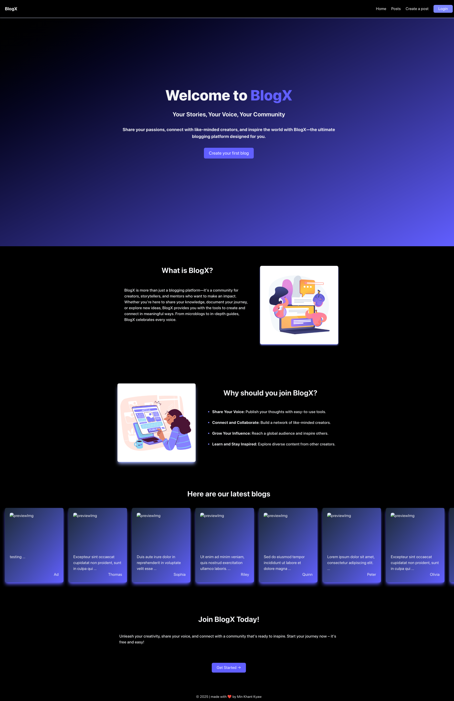

# **BlogX**

## **1. Introduction**

Welcome to **BlogX**—a great place to write blog posts and share your thoughts with others. This project is a **multi-page blogging website** that allows users to **Create, Read, Update, and Delete** blog posts.

The website features:

- A **minimalistic landing page** showcasing recent blog posts.
- A **navigation bar** to access different pages (Login, Posts, Create Post, etc.).
- A **login system** (for demonstration purposes, you can use any username and password. Username must begin with capital letter).
- A **posts page** where users can view all published posts.
- A **detailed view page** for individual blog posts.
- **User permissions**—you can only edit or delete your own posts.
- A **create post page** where users can publish new blog posts.

All data operations are handled using **JSON-Server** as a **RESTful API**, with **Glitch.com** and **UptimeRobot** keeping the backend active even after deployment. Array methods such as splice, filter are mainly used to display data on the pages combining with html and css.

---

## **2. Tech Stack**

This project is built using:

- **Frontend:**
  - HTML
  - Tailwind CSS
  - JavaScript
- **Backend (for CRUD operations):**
  - JSON-Server (hosted on **Glitch.com**)
  - UptimeRobot (to keep JSON-Server always online)

> **Note:** GitHub Pages only support **static files**, so I researched an alternative method to simulate backend functionality online. Hosting JSON-Server on Glitch.com ensures users get the full experience of CRUD operations.

---

## **3. Installation**

### **Run Locally**

1. **[Download the ZIP file from releases](https://github.com/mkhantk/NCC-Assignments/releases/)**
2. **Extract the ZIP file**
3. **Open the folder in VS Code** (or any code editor).
4. **Run Live Server** (if using VS Code) to view the page locally.

> **Don't have VS Code?** Download it here: [VS Code Download](https://code.visualstudio.com/)

### **View Online**

Here is the live page hosted on GitHub pages:  
🔗 [Live Demo](https://mkhantk.github.io/NCC-Assignments/assignment4/src)

> if you are testing the one uploaded on the GitHub pages, Please be mind that only the images that are in the repo will be able to upload.
> Also, if you want to upload images while running the pages locally with live server, please copy or move the images to the src folder of the project folder.
> Thanks.

made with ❤️ by Min Khant Kyaw
