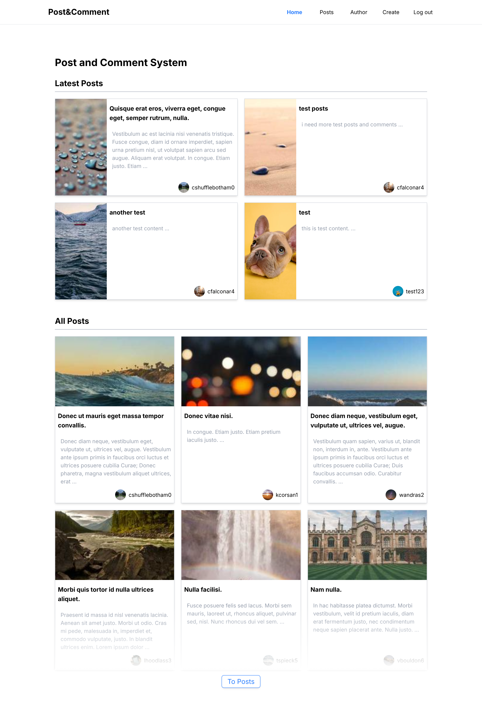

# Post and comment system

## Functions

1. sign up to create a new user.

2. login either with phone number or email.

3. create new posts and comment

4. delete posts and comments by the user.

## Technologies

1. React

2. TailwindCSS

3. Json Server

4. React Router

## Instruction

1. **Download and unzip**
   - Download the zip file [here](https://github.com/mkhantk/NCC-Assignments/releases/tag/v6.0) and extract it
2. **Install Dependencies**
   - open terminal in the project folder and run `npm install`
3. **Start JSON Server**

   - run `npx json-server src/db.json` in the terminal to get the endpoints for the app.

4. **Run the project**
   - start development server with `npm run dev`
   - open browser and go to `http://localhost:5173` to view the app.

## Summary

I mainly use react hooks like useState, useReducer and useContext to handle the flow of the app. After that i use React Router to handle the navigation. Used json-server to create a local server to handle the data usages like get, post, patch and delete using axios. I also add pagination in the post page as well for better display of posts. Overall, by creating this app, I've learned the basic flow of a CRUD app looks like.
